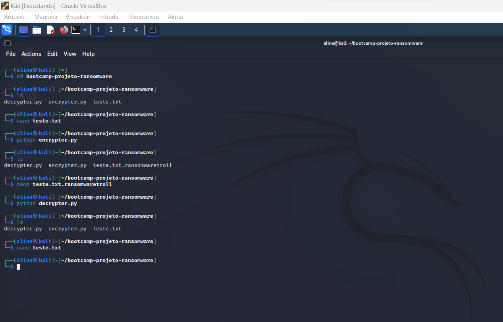
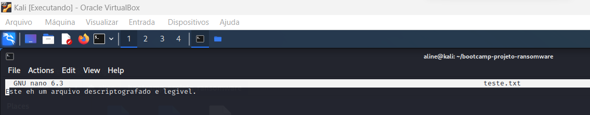
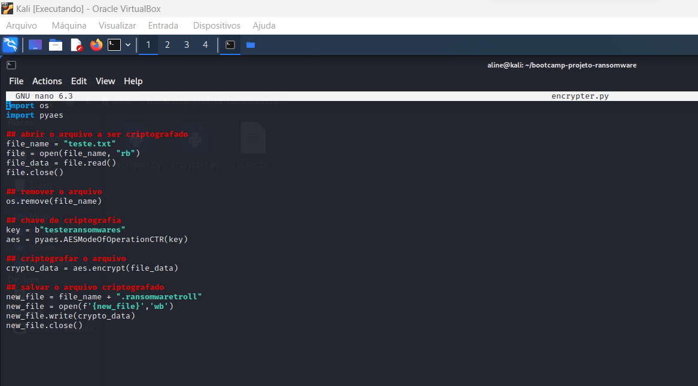
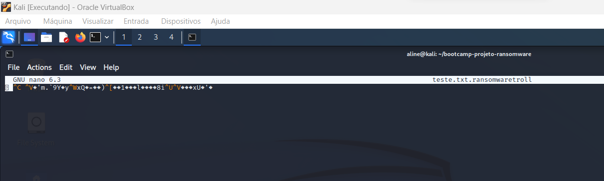
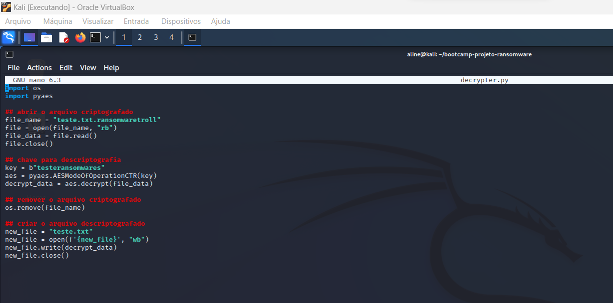

# Desafio: Criando um Ransomware com Python

### Comandos

- Criando um diretório: ``` mkdir bootcamp-projeto-ransomware ```
- Entrando no diretório: ``` cd bootcamp-projeto-ransomware ```
- Criando o arquivo txt: ``` touch teste.txt ```
- Criando o arquivo python para criptografar: ``` touch encrypter.py ```
- Criando o arquivo python para descriptografar: ``` touch decrypter.py ```
- Listar todos os arquivos: ``` ls ```
- Abrindo o arquivo de teste: ``` nano teste.txt ```
- Criptografando o arquivo: ``` python encrypter.py ```
- Listar todos os arquivos: ``` ls ```
- Abrindo o arquivo criptografado: ``` nano teste.txt.ransonwaretroll ```
- Descriptografando o arquivo: ``` python decrypter.py ```
- Abrindo o arquivo descriptografado: ``` nano teste.txt ```

### Resutados






